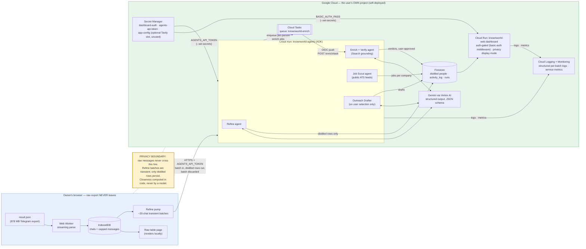

# Knownworld

**Turns your own Telegram DMs into a personal warm-network contact database — for networking and warm-path job discovery.**

Open source. Self-deployed into **your own** Google Cloud project. Your raw
chat export is parsed entirely in your browser and never leaves it — the
cloud side only ever sees small transient batches and stores the distilled
rows you can inspect and delete.

## How it works

1. **Export** your Telegram data (Telegram Desktop only) — [guide](docs/01-export.md).
   Drop `result.json` on the onboarding page; a Web Worker streams it into
   IndexedDB, fully client-side. An 878 MB export parses in the browser.
2. **Refine** — the browser pumps transient ~20-chat batches to the agents
   service (Google ADK on Cloud Run). Gemini distills each batch into people
   rows under a schema-enforced JSON contract; the batch is discarded and
   only distilled rows persist to Firestore. Closeness is computed in code
   at ingest — never by a model.
3. **Enrich + verify** — one Cloud Tasks job per person. Gemini with Google
   Search grounding checks name + company against the public web and returns
   a **cited** verdict: `match`, `possible_mismatch`, or `unverified` — no
   guessing, ever.
4. **Job scout** — live-verifies public ATS feeds (Greenhouse/Lever-style
   slugs) for the companies where your people work, pulls real postings, and
   ranks role fit with your warm paths.
5. **Outreach + pipeline** — drafts a warm message only for a person you
   select (toned by closeness, grounded on the stored summary), then tracks
   outreach → referred → interview → offer on a pipeline board.

Numbers from the real run behind this repo: 878 MB export → 3,638 chats
parsed in-browser → 62 refine batches → 423 distilled people → grounded
enrich verdicts with citations (including a naturally caught stale entry) →
697 real postings from live-verified ATS slugs → warm-path role fits →
outreach drafts at ~$0.00007 each. Total model spend ≈ $0.19.

## Privacy model, stated plainly

- **Raw export**: parsed in the browser (Web Worker → IndexedDB). Never
  uploaded anywhere.
- **Refine batches**: transient. Sent over HTTPS with an app token, distilled
  server-side, then discarded — raw messages are never written to any store
  outside your browser.
- **Firestore**: distilled rows only (name, company, role guess, 2-line
  summary, closeness, telemetry). You can see and delete everything.
- **Search**: name + company are the only search queries ever issued (Gemini
  Search grounding for enrich; public ATS feeds for jobs). No logins, no
  scraping, no emails.
- **Rendering**: the dashboard has a privacy display mode that masks names;
  both deployed services are auth-gated (basic auth on the dashboard, app
  token on the agents API).
- **Self-deploy is the product**: the whole stack runs inside *your* GCP
  project under *your* billing. There is no shared server and no operator who
  can read anyone's data.

## Architecture



Source of truth: [`infra/architecture.mmd`](infra/architecture.mmd).

## Quickstart — local dev (no GCP needed)

Two services; run each in its own terminal. `FAKE_LLM=1` stubs Gemini and
uses an in-memory store, so the whole loop runs offline — no GCP auth, no
spend.

```sh
# 1) agents service → http://localhost:8080
cd agents
python3 -m venv .venv
.venv/bin/pip install -r requirements.txt
FAKE_LLM=1 .venv/bin/uvicorn app.main:app --port 8080

# smoke check (in another terminal)
curl -s localhost:8080/health
```

```sh
# 2) web dashboard → http://localhost:3040
cd web
npm install
npm run dev -- -p 3040
# open http://localhost:3040 and follow onboarding
```

The web app reaches the agents service via `NEXT_PUBLIC_AGENTS_URL`, which
defaults to `http://localhost:8080` — no env file is needed for local dev.
If 8080 is taken on your machine (`address already in use`), pick another
`--port` and start web with `NEXT_PUBLIC_AGENTS_URL=http://localhost:<port>`.
Every env var is documented in [`.env.example`](.env.example). Locally the
dashboard auth gate is off (it activates whenever `BASIC_AUTH_PASS` is set;
deploys always set it).

## Tests

```sh
# web — 21 tests (vitest)
cd web && npm test

# agents — 86 tests (FAKE_LLM + in-memory store; no network, no GCP)
cd agents && .venv/bin/python -m pytest -q
```

Typecheck note: in `web/`, `npx tsc --noEmit` depends on Next's generated
route types — run `npx next build` (or `npx next typegen`) once first on a
fresh clone, otherwise it fails on `LayoutProps`.

## Deploy — your own Google Cloud project

Self-deploy is the product. Three commands against your own project id:

```sh
gcloud auth login && gcloud auth application-default login
PROJECT_ID=<yours> ./infra/setup-gcp.sh
PROJECT_ID=<yours> ./deploy.sh
```

Full guide (secrets model, Cloud Tasks wiring, deploy order, budget, and the
gotchas we hit on a fresh project): [`infra/README-DEPLOY.md`](infra/README-DEPLOY.md).
Record of the live deployment + proof pack: [`DEPLOYMENT.md`](DEPLOYMENT.md).

## Hackathon note

Built for the **All Things Agentic** hackathon. The docs/spec skeleton
(`SPEC.md`, `ROADMAP.md`, `docs/01-export.md` … `docs/04-job-run.md`)
predates the hackathon window and is disclosed as prior ideation — it
describes an earlier copy-paste concept, not the shipped system. All code
was written within the window; the current build is specified by
[`SPEC-HACKATHON.md`](SPEC-HACKATHON.md) and this README.

License: MIT (placeholder — final call pending)
