<div align="center">


# Knownworld

**Your Telegram history, turned into a private, enriched contact database you
can actually ask: "who should I meet?", "is there a job for me?" The answers
come from your own network, with warm paths instead of cold lists.**

### 🚀 Live instance: [knownworld-web-ncr73a6xhq-uc.a.run.app](https://knownworld-web-ncr73a6xhq-uc.a.run.app)

Create an account, press "Try the demo network", and you are five minutes
from a working database. Nothing to install, nothing to upload.

*Built for the Google **All Things Agentic** hackathon (The Taskmaster track):
Gemini, Google ADK, Cloud Run, Firestore. Open source, multi-account,
self-deployed into your own Google Cloud project.*

</div>

---

## ▶ The video

[](https://www.youtube.com/watch?v=BGWH5f6vfko)

**[▶ Watch the 4-minute demo](https://www.youtube.com/watch?v=BGWH5f6vfko)**: the
problem, a live run, and the Google Cloud proof.

---

## What it does

Everyone tells job seekers that their network is the best way in, but
nobody explains how to actually query a network. A decade of Telegram DMs is an
878 MB JSON file full of names you half-remember and companies people left
years ago. Knownworld is a five-agent pipeline that turns it into something
you can ask:

1. **Ingest.** Your Telegram export is parsed entirely in the browser
   (streaming Web Worker into IndexedDB; multi-gigabyte files work). Raw
   chats never leave your machine.
2. **Refine** (Gemini, schema-enforced JSON). Chats stream to the model in
   transient batches of about 20; each batch is discarded once the distilled
   rows come back: name, company (definite and inferred are kept apart,
   never merged), role guess, a two-line summary. Closeness is computed in
   code from volume and recency; a model never scores it.
3. **Enrich + Verify** (Gemini with Google Search grounding, fanned out
   through Cloud Tasks). One grounded lookup per contact: what they do now,
   how they can help you, work history, location with map coordinates, and
   citations for every claim. The match / possible-mismatch / unverified
   verdict is computed in code by comparing evidence to your database.
   People who cannot be resolved stay unverified. No guesses.
4. **Job Scout.** Dedupes your contacts' companies and hits their live
   public ATS feeds (Greenhouse, Lever, Ashby, Workable, SmartRecruiters).
   Feed identity is verified in code, so a plausible-looking slug is never
   trusted and a warm intro never points at the wrong company's job. Every
   posting comes with its warm path: your contacts there, ranked by
   closeness.
5. **The Requests chat** (planner, matcher, web scout, composer). Free-text
   questions are routed by a schema-enforced planner into jobs, people,
   brief, or intro executors. A grounded web scout joins in when the answer
   needs fresh public facts, like conferences or news. Every answer is
   prose plus clickable findings, sources, and contacts.

The app never sends messages anywhere. Drafts are copy-out only; you send
them yourself from Telegram.

## The privacy boundary (architecture, not promises)

- **What leaves the browser:** transient refine batches to the Gemini API
  (batch in, rows out, batch discarded); name plus company as search
  queries during research; company names to public job boards. That is the
  complete list.
- **What is stored server-side:** only the distilled rows and research
  cards you can see, edit, and delete, scoped to your own account.
- **What is never stored:** message content. The raw export lives in your
  browser's IndexedDB only.
- **Self-deploy is the product.** One script stands the whole stack up in
  your own GCP project. No shared server, no operator who can read your
  data. The Privacy page in the app spells all of this out and carries the
  delete-everything switch.

## Architecture

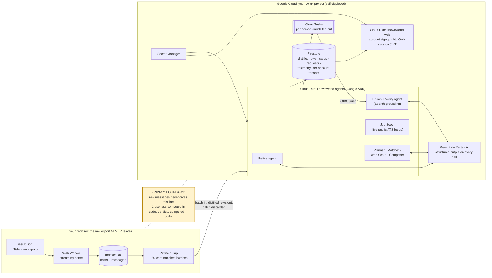

**Engineering rules, enforced in code and covered by tests:**

| Rule | Where |
|---|---|
| Raw export never leaves the browser | Web Worker into IndexedDB; refine sends transient batches only |
| Closeness never comes from a model | computed at ingest; model-sneaked values proven dropped |
| Schema-enforced JSON on every model call | malformed output rejected with reasons, never patched |
| Verdicts computed in code | evidence compared to the DB; a mismatch never auto-rewrites your data |
| Owner edits are definitive | inline Edit marks the row verified by owner; re-research never overwrites an owner correction |
| ATS slugs live-verified only | board-identity checks; no hand-invented slugs, ever |
| Per-call telemetry | agent, resolved model id, tokens, estimated cost, duration, in the activity log |
| Tenant isolation | every store scoped by account; delete wipes only the caller's tenant |

Tests: **152 service + 34 web**, all runnable with zero cloud credentials.

---

## Try it, step by step

The [deployed instance](https://knownworld-web-ncr73a6xhq-uc.a.run.app)
runs the real mandated stack: Gemini 3.5 Flash via ADK on Vertex AI, Cloud
Run and Firestore.

### 1 · Create an account

Email plus password, or the Google button. The account is the data
boundary: every row lives in your own tenant, and the Privacy switch wipes
only yours.

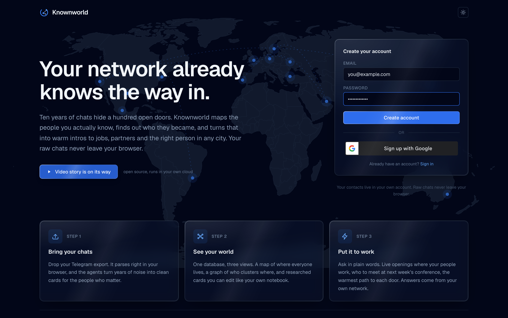

### 2 · Get chats to load

Two ways:

- **Your own history:** Telegram Desktop, Settings, Advanced, "Export
  Telegram data", format "Machine-readable JSON" (untick media). You get a
  `result.json`.
- **The demo network:** an openly fictional network of 15 famous founders
  (invented conversations, real public companies).
  **[⬇ Download the demo contacts](sample-data/result.json)**
  ([raw file](https://raw.githubusercontent.com/OGcryptonaut/knownworld/main/sample-data/result.json),
  [what's inside](sample-data/README.md)). Or simply press **"Try the demo
  network"** on the upload step; it loads the same file.

### 3 · Upload: parsed in your browser

Drop the file, or click the demo button. A Web Worker streams it into
IndexedDB right in the tab. The progress bar is a parse, not an upload.

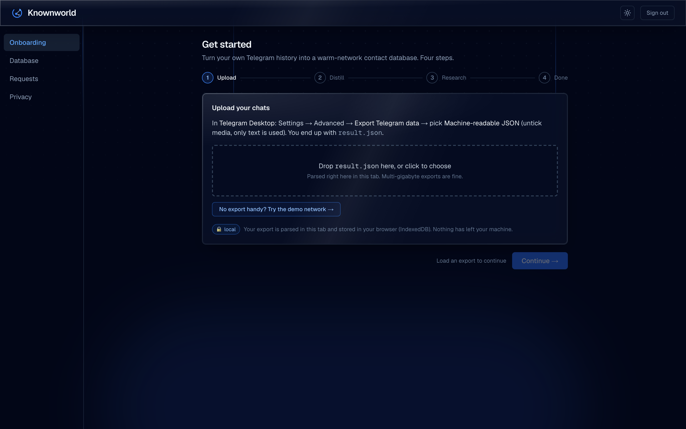
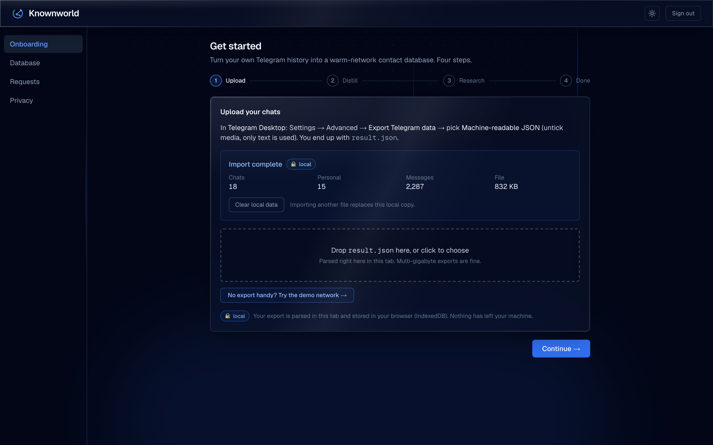

### 4 · Distill: Gemini turns chats into contact rows

Transient batches go to the model under a JSON-schema contract. Live
telemetry shows the resolved model id, tokens, cost, and duration per
batch.

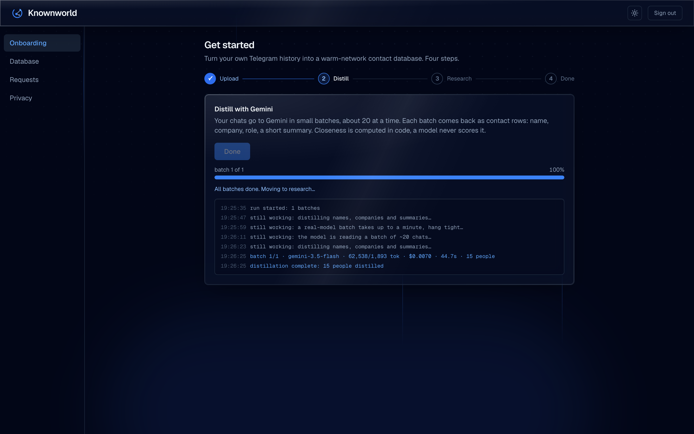

### 5 · Research: one grounded lookup per contact

Each work-relevant contact gets one Google-grounded pass. The query is a
name plus a company, nothing else. Citations on every claim; the verdict
chips are computed in code.

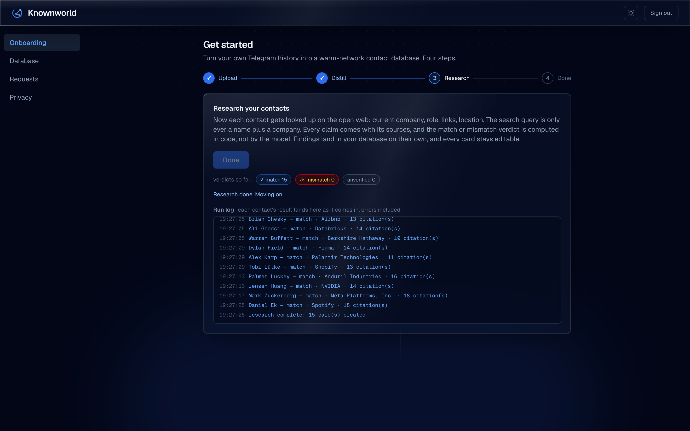

### 6 · Your known world is ready

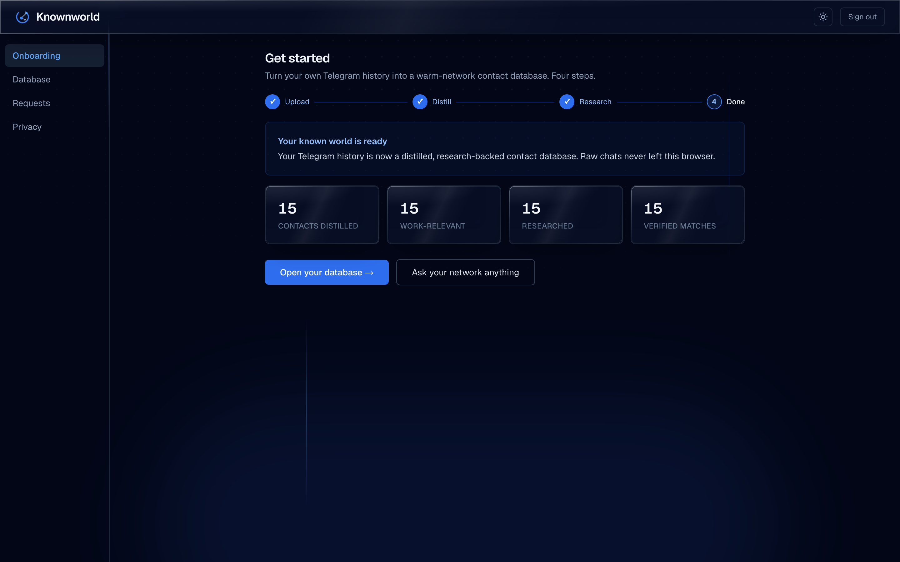

### 7 · The Database: one dataset, three views

A map (dot size is closeness, clusters collapse into counts), a network
graph (lenses for companies, cities, tags, closeness), and the table below.
All three run off one shared filter chain. Click any row, map dot, or graph
node...

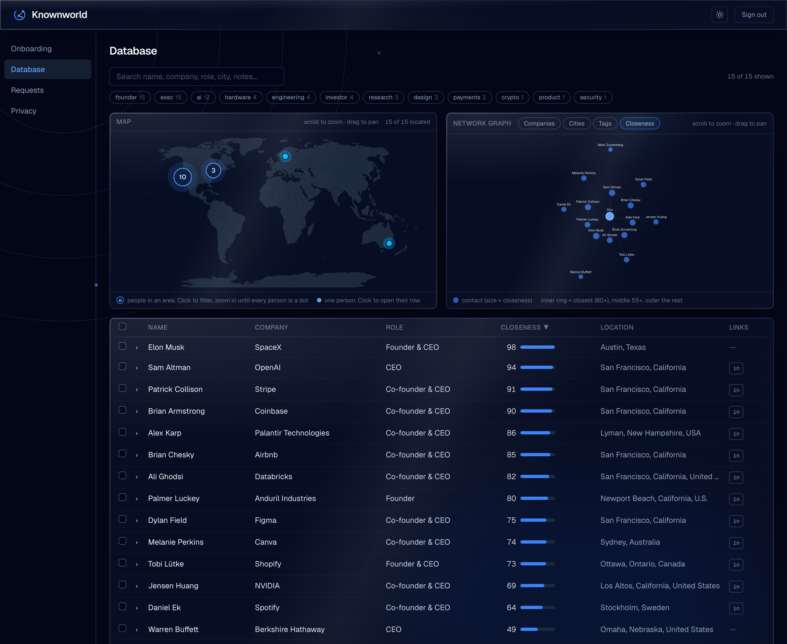

...and the card expands inline: what they do now, how they can help you,
work history, footprint, every source linked. **Edit** is the one user
action. An owner correction is definitive and survives any later
re-research. **Research again** runs a fresh grounded pass and appends a
dated changelog of exactly what changed.

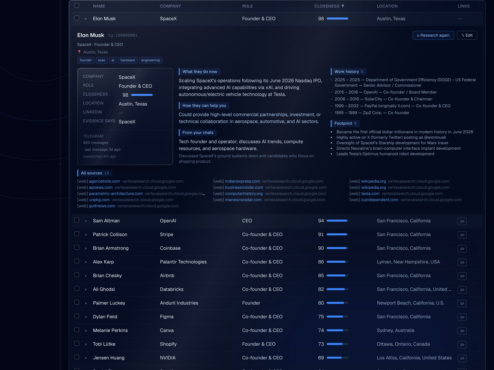

### 8 · Requests: ask your network anything

Free-text questions become conversations. A schema-enforced planner routes
each ask, and the live log shows every agent step while it runs.

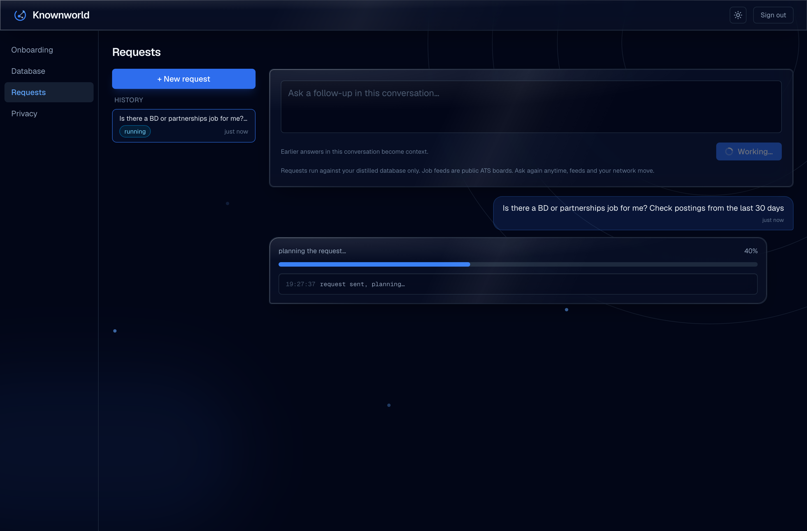

*"Is there a BD or partnerships job for me, posted in the last 30 days?"*
Live postings from your contacts' real ATS feeds, filtered in code by
role fit, place, and recency. Each posting carries its warm path, plus
honest stats on what was scanned and dropped:

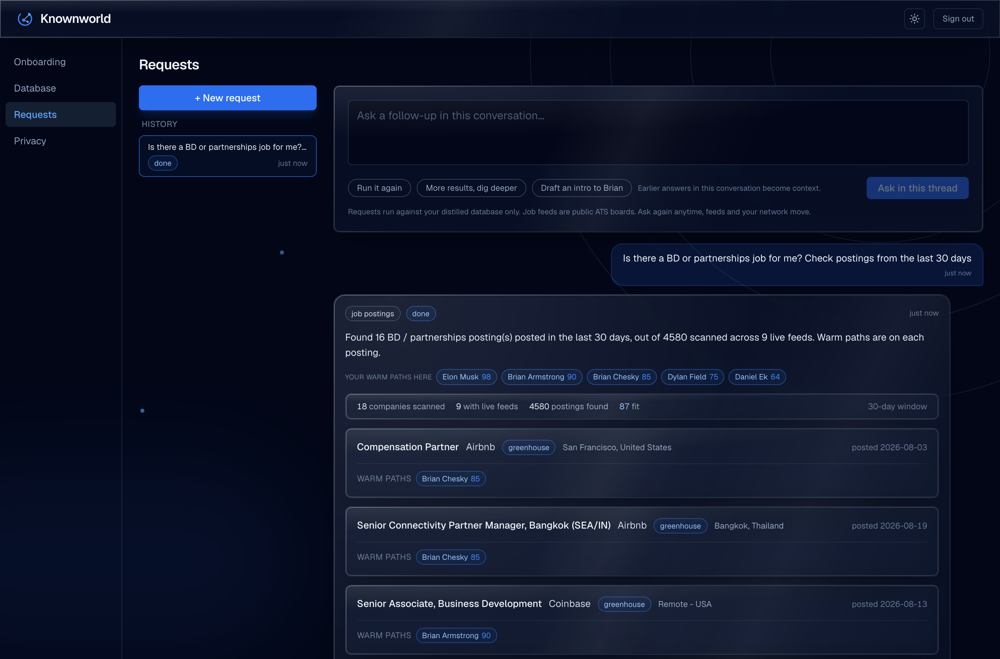

Also in the box: "who should I meet at an AI conference in SF?" (grounded
matches with reasons and linked sources), "prepare custdev questions for a
meeting with X" (a brief composed over the full research cards), and
"draft an intro to X" (copy-out only; the app never sends anything). Ask
again next week: feeds and your network move, and every request is a
stored snapshot.

---

## Run it locally (zero cloud, zero keys)

```bash
cd web && npm install && npm run dev -- -p 3040
```

```bash
cd agents && python3 -m venv .venv && .venv/bin/pip install -r requirements.txt && ./run-local.sh
```

Open http://localhost:3040, create an account, press "Try the demo
network", and walk the wizard. Local dev runs the on-disk store and a
deterministic FAKE model. Telemetry labels every such row `fake:`, so the
app never pretends a model ran when it didn't. Job feeds are the only live
calls.

| Backend | When | How |
|---|---|---|
| **Gemini via ADK / Vertex** | every deploy, the hackathon mandate | default; `deploy.sh` refuses anything else |
| FAKE (deterministic stub) | local testing, zero credentials | `FAKE_LLM=1` (the local default) |
| Claude (dev only) | fast local iteration | `MODEL_BACKEND=claude`; never deployable |

Tests:

```bash
cd agents && .venv/bin/python -m pytest -q   # 152 service tests
```

```bash
cd web && npm test                            # 34 web tests
```

## Deploy your own (self-deploy IS the product)

```bash
export PROJECT_ID=<your-gcp-project>
bash infra/setup-gcp.sh   # APIs, Firestore, SA + roles, Tasks queue, secrets, budget
bash deploy.sh            # agents, then web (Gemini enforced, STORE_MODE=firestore)
```

See [infra/README-DEPLOY.md](infra/README-DEPLOY.md) and
[DEPLOYMENT.md](DEPLOYMENT.md) for the full walkthrough.

## Repo layout

- [`web/`](web/) is the Next.js app: onboarding wizard, Database (map,
  graph, table, cards), Requests chat, Privacy; the session gate lives in
  `src/proxy.ts`.
- [`agents/`](agents/) is the FastAPI + Google ADK service: refine,
  enrich + verify, planner, matcher, web scout, composer, job scout (5 ATS
  clients), drafter, auth, multi-tenant stores, telemetry. `tests/` runs
  fully offline.
- [`sample-data/`](sample-data/README.md) holds the demo dataset generator,
  its fact sidecar, and the golden reference.
- [`data/ats-slugs.json`](data/ats-slugs.json) is the live-verified
  company-to-job-feed registry.
- [`docs/screenshots/`](docs/screenshots/) holds the walkthrough frames above,
  captured on the deployed instance.
- [`EVALUATING.md`](EVALUATING.md) is the five-minute judge path.

---

<div align="center">
<sub>Built inside the hackathon window; the commit history is the build
log. A fully local-first variant (no cloud at all) is the roadmap's next
stop.</sub>
</div>
